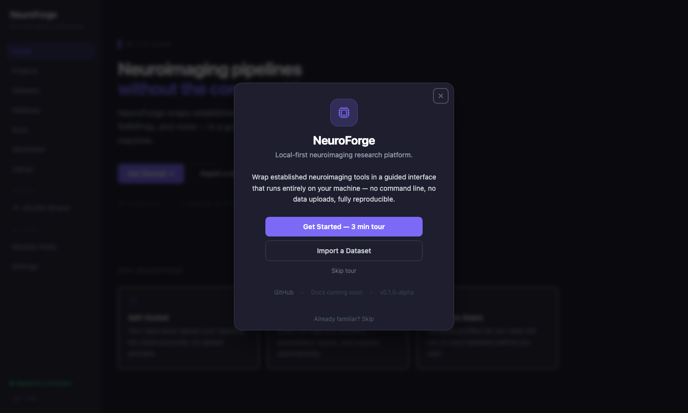
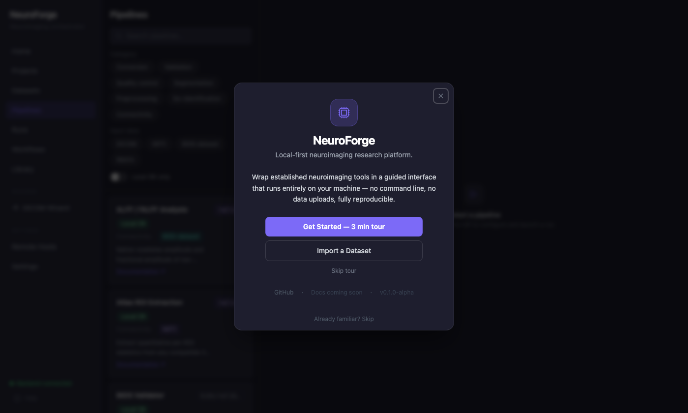
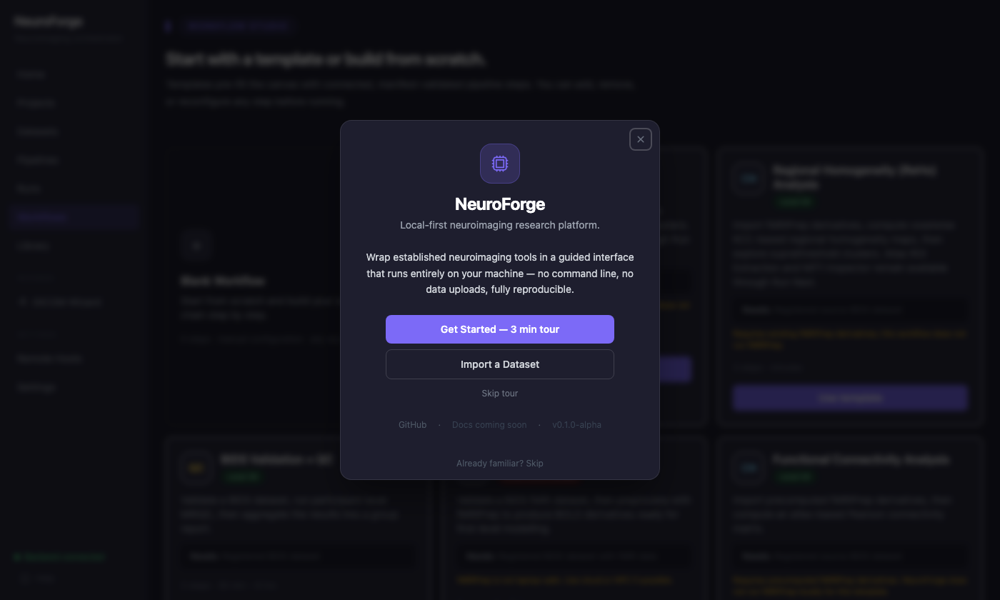
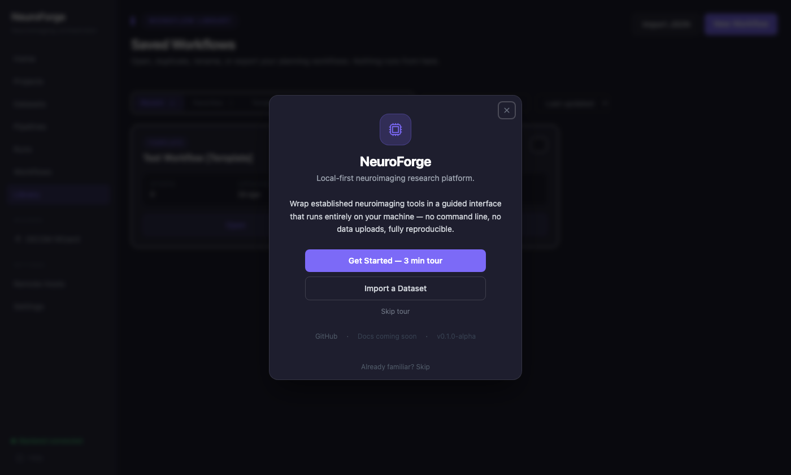
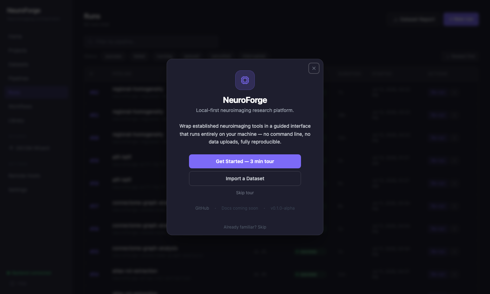
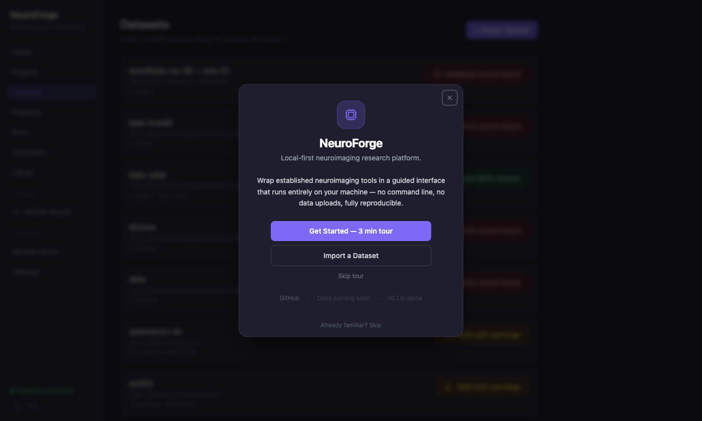

# NeuroForge

[](https://github.com/SadhanaArivoli/neuroforge/actions/workflows/ci.yml)
[](LICENSE)
[](CHANGELOG.md)

**A local-first neuroimaging research platform that connects your datasets, pipelines, artifacts, methods, and publication outputs in one place.**

Neuroimaging research is not hard because the science is unclear. It is hard because the infrastructure around the science — installation, formatting, execution, logging, comparison, and writing — absorbs enormous time and does not connect. NeuroForge is built to close that gap: not by replacing FSL, FreeSurfer, fMRIPrep, or Nilearn, but by giving those tools a shared workspace with reproducibility, traceability, and publication workflow built in from the start.

---

## The Problem

If you have run a neuroimaging study from raw data to a published methods section, you know the gap that exists between the tools and the work.

**Tool fragmentation.** A typical fMRI workflow touches dcm2niix, dcm2bids, the BIDS Validator, MRIQC, fMRIPrep, Nilearn, and possibly FSL or AFNI — each with its own installation, its own command syntax, its own output convention, and its own failure modes. None of them know the others exist. Getting from DICOM to a connectivity matrix is a coordination problem disguised as a science problem.

**No shared record.** Most analyses are conducted by running commands in a terminal and hoping the shell history survives. What parameters were used? Which version of FSL? Was the atlas resampled? In most labs, the honest answer is: it depends who you ask and when.

**Error opacity.** Neuroimaging tools produce errors written for their developers, not their users. `recon-all exited with code 1` does not tell a graduate student why it exited, what was wrong with their T1, or what to try next. Most student time spent "debugging" is actually spent decoding stack traces.

**Reproducibility debt.** Journals now expect detailed methods, version numbers, parameter tables, and BIDS compliance statements that take hours to assemble after the fact — and are often assembled from memory. The information existed at run time. It was just never captured.

**Comparison by hand.** Comparing two skull-strip methods, two atlas parcellations, or two preprocessing pipelines requires writing custom Python scripts for every comparison. The analysis tools produce outputs; nothing ties those outputs back together for review.

**Publication friction.** Between a completed analysis and a submitted methods section lies a manual process: collecting commands, finding version strings, formatting citations, writing prose, compiling figures. None of the analysis tools help with this. It is done outside them, usually at the end of a project, usually under deadline.

NeuroForge exists because these are workflow problems, not science problems, and they should be solved at the infrastructure level.

---

## Why NeuroForge Exists

NeuroForge is a local-first research workspace. It is not a pipeline runner with a GUI grafted on. It is not a viewer. It is not another BIDS tool.

The design premise is that a neuroimaging project has a natural structure — datasets, runs, artifacts, comparisons, methods, citations, reports — and that structure should be explicit, navigable, and machine-readable throughout the entire workflow. Every time you run a pipeline in NeuroForge, the system records what ran, what version, what parameters, what it consumed, and what it produced. Every artifact is typed and catalogued. Every downstream step knows what upstream steps can feed it. The analysis graph shows the full processing history of a dataset as a directed graph. The methods section writes itself from the provenance records.

The goal is not to make neuroimaging faster. It is to make it reproducible, organized, and publication-ready by the time the analysis is done rather than after.

---

## How NeuroForge Differs From Existing Tools

The following comparison is honest. These tools are excellent. NeuroForge complements them; it does not compete with them.

| Tool | What it does well | What NeuroForge adds |
|------|-------------------|----------------------|
| **FSL** | Robust, validated structural and functional processing; BET, FIRST, FLIRT, FEAT | Artifact-typed output chaining, provenance logging, error translation, workflow visualization |
| **FreeSurfer** | Gold-standard cortical surface reconstruction and parcellation | Run tracking, status monitoring, retry on failure, output cataloguing |
| **SPM** | Established preprocessing and GLM framework, large user base | Reproducibility records, version capture, parameter persistence across runs |
| **AFNI** | Flexible scripting, strong QC tools | Unified run history, plain-English error explanations, workflow lineage |
| **MRtrix3** | State-of-the-art diffusion tractography | Planned integration with NeuroForge's artifact and provenance system |
| **Nilearn** | Excellent Python API for connectivity and decoding | Wrapped with a guided parameter interface, atlas management, interactive result panels, and auto-generated methods prose |
| **Brainlife** | Cloud-based app marketplace and reproducible execution | Local-first with no cloud dependency; all data stays on the researcher's machine |
| **MRIQC** | High-quality image quality metrics and reports | Integrated into a workflow with automatic chaining to preprocessing, report comparison, and aggregate dashboards |
| **QSIPrep** | Comprehensive diffusion preprocessing | Planned — not yet implemented |
| **fMRIPrep** | Robust, citation-ready fMRI preprocessing | Import of precomputed derivatives into the NeuroForge artifact system; full local re-execution is impractical on laptop hardware |

The pattern is consistent: existing tools do the science. NeuroForge adds the workspace — the shared record, the artifact graph, the comparison layer, the methods output.

---

## What Makes NeuroForge Different

### Manifest-Driven Architecture

Every pipeline is defined by a YAML file in `pipelines/`. The application has no hardcoded knowledge of what any tool accepts or produces. Manifests declare typed inputs, typed outputs, parameters with defaults and validation, compute profiles, known error patterns, and execution targets. Adding a new tool means writing a manifest. Modifying a parameter means editing YAML. No application code changes.

### Artifact-Typed Pipeline Chaining

Every run produces typed artifacts: `bids_dataset_validated`, `fmriprep_derivatives`, `connectivity_matrix_csv`, `seed_connectivity_map_nii`, `statistical_map_thresholded`, and so on. The compatibility API queries these types to surface valid next steps. A Seed Connectivity run knows a Statistical Map Explorer can consume its output — not because a developer wrote that rule, but because the manifests declare it. The Workflow Builder uses this to build and validate chains without any hardcoded relationships.

### Analysis Graph

Every dataset has a directed graph of all its runs and artifact dependencies. Every node is a run; every edge is a typed artifact. You can see at a glance what was computed, in what order, from what source, and which runs share upstream inputs. This is not a visualization for its own sake — it is the lineage record made navigable.

### Comparison Studio

Side-by-side comparison of runs with quantitative metrics. Skull-strip comparisons compute Dice coefficient and display a difference NIfTI. Connectivity matrix comparisons compute Frobenius norm, correlation, and render a difference heatmap. Comparisons are classified as *same-source* (proven shared upstream BOLD input — a true methodological comparison) or *unverified* (same dataset, no confirmed lineage). That distinction is surfaced in the UI because it matters scientifically.

### Methods Studio

A draft methods paragraph generated directly from provenance records. It names tools, versions, atlases, parameters, and connectivity specifications in the format a methods section expects. This is not AI-generated text — it is structured template filling from the audit trail. If you ran Functional Connectivity with Schaefer 100-parcel 7-network and Pearson correlation and Nilearn 0.14.0, the methods section says exactly that.

### Study Report Studio

Assembles a complete study report across all successful runs for a dataset: pipeline summary, methods paragraphs, citations, artifact inventory, quality metrics, and cluster analysis results (when present). Reports are generated as structured HTML with a PDF export option. Multiple reports can be compared structurally — which runs were added, which pipelines changed, which warnings appeared or resolved — without any AI involvement.

### Artifact Explorer

A searchable, filterable catalogue of every artifact produced by every run on a dataset. Artifacts are typed, labelled, and previewed in-context: NIfTI files open in a volumetric viewer, connectivity matrices render as interactive heatmaps, PNG figures render inline, HTML reports embed directly, CSV and JSON files preview in a table. Download All packages everything into a zip.

### Run Results Panels

Each pipeline has a structured result panel tailored to its outputs. Functional Connectivity shows an interactive connectivity matrix with hover-to-inspect, ROI statistics, and time-series downloads. Seed Connectivity shows the voxelwise z-map and metadata. Statistical Map Explorer shows a cluster table with MNI coordinates, a cluster overlay mosaic, summary stats, and links to the HTML cluster report. Graph Analysis shows global graph metrics and a sortable node table. These are not generic file lists — they interpret the outputs in context.

### Statistical Map Explorer

A native Python cluster analysis tool (no FSL, AFNI, or SPM dependency) for statistical NIfTI maps: z-maps, t-maps, beta maps, contrast maps, seed connectivity maps, ALFF, and ReHo. Applies user-defined thresholds (positive, negative, or two-sided), detects clusters with 6-connectivity labelling via `scipy.ndimage`, and computes per-cluster statistics: size, peak value, mean value, MNI coordinates, center of mass, and bounding box. Outputs include a thresholded NIfTI, CSV/JSON cluster tables, a matplotlib axial overlay figure, and a self-contained HTML cluster report. No random field theory, no permutation testing, no inferential statistics — all values are derived directly from the data.

### Connectome Graph Analysis

Graph-theoretic characterization of functional connectivity matrices using NetworkX: global efficiency, local efficiency, modularity (Louvain), clustering coefficient, characteristic path length, betweenness centrality, and per-node community assignment. Accepts connectivity matrices from any upstream Functional Connectivity run.

### Local First

Data never leaves the researcher's machine unless they explicitly configure a remote destination. No cloud account. No API key. No telemetry. The default deployment is Docker Compose on a laptop. When remote execution is implemented, it will route only to infrastructure the researcher owns and configures — SSH targets or self-hosted compute nodes — not through any NeuroForge-operated service.

---

## Scientific Reproducibility

Every run in NeuroForge stores a complete provenance record:

- Pipeline identifier and version string
- Full command executed
- All parameters, including defaults
- Container image and digest (for Docker-based pipelines)
- Input artifact paths and types
- Output directory and artifact paths
- Start timestamp, end timestamp, runtime
- Exit code and status
- Warnings emitted during execution

This record is captured at run time, stored in a local SQLite database, and never requires reconstruction from shell history. The `source_run_id` field links each run to the upstream run it was derived from, so the full processing lineage of any artifact is traceable back to its source data.

The Methods Studio and Study Report Studio use these records directly. There is no gap between what was run and what the report says was run.

---

## From Analysis to Manuscript

The typical path from a completed analysis to a submitted manuscript involves more manual work than the analysis itself: collecting version strings, formatting citations, writing methods prose, compiling figures, generating a supplementary table of parameters. Most of this information was present at run time and then discarded.

NeuroForge keeps it:

```
Dataset
  └─ Runs (provenance captured)
       └─ Artifacts (typed, catalogued, previewed)
            └─ Methods Studio (prose from provenance)
            └─ Citation Studio (bibliography from pipeline registry)
            └─ Study Report (assembled from all of the above)
                 └─ PDF export
```

The Study Report includes pipeline summaries, methods paragraphs with version numbers, a citation list, an artifact inventory, quality metrics, cluster analysis results, and a provenance section listing every run that contributed. It is not a substitute for scientific judgment — it is the infrastructure that makes judgment easier to document.

---

## Local First, By Design

NeuroForge is designed to run on a researcher's laptop without any cloud dependency:

- The Docker Compose deployment requires no external services after image pulls
- Data is mounted read-only from the host filesystem; NeuroForge never copies or moves source data
- The SQLite database, run logs, and derivatives are stored in the repository's `data/` directory
- No telemetry, analytics, or usage reporting is included or planned
- No account creation is required for any current feature

Future remote execution will be opt-in, researcher-configured, and will route only to infrastructure the researcher controls.

---

## Current Capabilities

### Conversion and Import

| Pipeline | Description | Compute profile |
|----------|-------------|-----------------|
| dcm2niix | DICOM → NIfTI | `local-ok` |
| dcm2bids + DICOM Wizard | Guided DICOM → BIDS with series scouting, entity mapping, config generation | `local-ok` |
| Import fMRIPrep Derivatives | Register precomputed fMRIPrep output as a typed artifact without re-running | `local-ok` |

### Validation and Quality Control

| Pipeline | Description | Compute profile |
|----------|-------------|-----------------|
| BIDS Validator | BIDS folder structure and metadata validation | `local-ok` |
| MRIQC | Per-subject image quality metrics and HTML reports (T1w, T2w, BOLD) | `local-ok` |
| MRIQC Group | Aggregate IQM table across subjects | `local-ok` |
| NIfTI Inspector | Header metadata, voxel statistics, intensity histogram, and warning summary for any NIfTI | `local-ok` |

### Skull Stripping

| Pipeline | Description | Compute profile |
|----------|-------------|-----------------|
| BrainChop | CNN-based skull stripping; ~21 s on Apple Silicon | `local-ok` |
| SynthStrip | FreeSurfer-team any-contrast skull stripping | `local-slow` (Rosetta 2 on Apple Silicon) |

### Segmentation and Surface Reconstruction

| Pipeline | Description | Compute profile |
|----------|-------------|-----------------|
| FastSurfer | Deep-learning cortical segmentation and surface reconstruction | `local-slow` |

### Functional Connectivity

| Pipeline | Description | Compute profile |
|----------|-------------|-----------------|
| Functional Connectivity | Atlas-based Pearson correlation matrix from fMRIPrep BOLD (Nilearn) | `local-ok` |
| Seed-Based Connectivity | Voxelwise seed connectivity z-map from one atlas ROI | `local-ok` |
| ALFF / fALFF | Voxelwise amplitude and fractional amplitude of low-frequency fluctuations from fMRIPrep BOLD | `local-ok` |
| Regional Homogeneity (ReHo) | Voxelwise Kendall's Coefficient of Concordance across 7/19/27-voxel neighborhoods | `local-ok` |
| Group Functional Connectivity | Across-run mean and standard-deviation connectivity matrix | `local-ok` |
| Atlas ROI Extraction | Per-ROI voxel statistics from any NIfTI input | `local-ok` |
| Connectome Graph Analysis | Graph-theoretic metrics (NetworkX + Louvain) from a connectivity matrix | `local-ok` |
| Statistical Map Explorer | Thresholding, connected-component clustering, and cluster reporting for statistical NIfTI maps | `local-ok` |

**Supported atlases (Functional Connectivity):** Schaefer 2018 100-parcel 7-network, Schaefer 2018 200-parcel 7-network, AAL 3v2, Harvard-Oxford cortical.

### De-identification

| Pipeline | Description | Compute profile |
|----------|-------------|-----------------|
| pydeface | Facial feature removal from structural NIfTI | `local-unsafe` (FLIRT-based; resource-intensive) |

### Workspace and Workflow

| Feature | Description |
|---------|-------------|
| Workflow Builder | Visual linear pipeline builder; validates step compatibility from artifact types |
| Workflow Library | Save, load, export, and import named workflows; template promotion |
| Workflow Templates | Pre-built starting points: BIDS+QC, fMRI Preprocessing, Functional Connectivity, Skull Strip+Segment, Seed FC → Statistical Map Explorer, ALFF/fALFF, Regional Homogeneity, and more |
| Execution Queue | Sequential in-process queue; cancel, retry, re-run, duplicate |
| Stalled-run detection | Orphaned runs at restart are marked *interrupted* with a Retry button |

### Analysis and Review

| Feature | Description |
|---------|-------------|
| Analysis Graph | Directed graph of all runs and artifact dependencies for a dataset |
| Artifact Explorer | Typed, labelled, previewed catalogue of all run outputs; NIfTI viewer, matrix heatmap, HTML preview, CSV/JSON table, Download All |
| Comparison Studio | Quantitative side-by-side comparison: skull-strip Dice, connectivity matrix Frobenius norm and difference heatmap |
| Dataset Dashboard | Subject/session/modality overview, run history, quick-launch links |
| Run Results Panels | Pipeline-specific output interpretation: connectivity matrix canvas, ROI statistics table, cluster table with MNI coordinates, graph metrics grid |

### Reproducibility and Publication

| Feature | Description |
|---------|-------------|
| Methods Studio | Draft methods paragraph assembled from provenance records; named tools, versions, atlases, parameters |
| Citation Studio | Reference list generated from pipeline registry; BibTeX-compatible |
| Study Report Studio | Full dataset report: pipeline summary, methods, citations, artifact inventory, cluster results; PDF export; multi-report comparison |
| Provenance records | Per-run: pipeline ID, version, command, parameters, container digest, input paths, output paths, timestamps, exit code |
| Run lineage | `source_run_id` links runs to their upstream source; used by Analysis Graph and Comparison Studio |

---

## Roadmap

### Implemented

- DICOM conversion and BIDS formatting with guided wizard
- BIDS validation and MRIQC quality control
- Skull stripping (BrainChop, SynthStrip), segmentation (FastSurfer)
- Import and management of fMRIPrep derivatives
- Functional connectivity (atlas-based), seed connectivity, ALFF/fALFF, regional homogeneity (ReHo/KCC), group connectivity
- Atlas ROI extraction and connectome graph analysis
- Statistical map thresholding and cluster analysis
- NIfTI Inspector
- Workflow Builder, Library, and Templates
- Artifact Explorer with typed previews
- Comparison Studio (masks and matrices)
- Methods Studio, Citation Studio, Study Report Studio
- Analysis Graph and run lineage
- PDF report export

### Planned

- **fMRIPrep local verification** — currently marked `local-unsafe` due to ANTs under Rosetta 2; validating a stable execution path on Apple Silicon
- **Diffusion MRI** — QSIPrep preprocessing, MRtrix3 tractography
- **Surface analysis** — FreeSurfer-native pipeline integration, surface-based connectivity
- **Group-level statistics** — second-level GLM, group comparison (no inferential stats without validation)
- **Longitudinal studies** — subject-level longitudinal workflow tracking
- **Remote execution** — SSH dispatch and SLURM scheduling to researcher-owned compute nodes
- **XCP-D** post-processing integration
- **Plugin manifest registry** — community-contributed pipeline manifests

---

## Who NeuroForge Is For

**Graduate students and early-career researchers** who have data and analytical goals but are spending their time learning installation procedures and command syntax rather than asking scientific questions. NeuroForge makes the infrastructure explicit and forgiving without hiding what it does.

**Lab PIs and research coordinators** who need consistent, documented workflows across multiple projects and lab members. Every run is logged. Every parameter is captured. Reproducibility is not an afterthought.

**Teaching labs and methods courses** where students need to run real analyses without spending a semester on toolchain setup. The guided interface, plain-English error explanations, and workflow templates make it possible to run a BIDS + MRIQC + Functional Connectivity workflow in an afternoon.

**Open science practitioners** who want to publish analyses with complete provenance, full parameter tables, and auto-generated methods sections. NeuroForge makes the documentation byproduct of the analysis, not a separate task.

---

## Philosophy

NeuroForge is not competing with FSL, FreeSurfer, AFNI, fMRIPrep, Nilearn, or MRtrix3. Those tools represent decades of validated scientific software. NeuroForge does not reimplement their algorithms, replicate their validated outputs, or substitute for the expertise required to use them well.

What NeuroForge does is address the layer above them: the coordination, the logging, the formatting, the comparison, the documentation, the publication workflow. It is built on the premise that reproducible, organized, transparent neuroimaging research should not require a systems administrator's skill set in addition to a neuroscientist's.

The test of a good platform is not whether it has the most features. It is whether a researcher who finishes an analysis with it has everything they need to explain, defend, and reproduce that analysis in three months, or three years, without consulting their shell history.

---

## Screenshots

| Home | Pipelines |
|------|-----------|
|  |  |

| Workflow Builder | Workflow Library |
|-----------------|-----------------|
|  |  |

| Run History | Datasets |
|-------------|---------|
|  |  |

---

## Local Setup

### Requirements

- Docker Desktop (8 GB memory allocation recommended)
- Git

### Quick start

```bash
git clone https://github.com/SadhanaArivoli/neuroforge.git
cd neuroforge
cp .env.example .env   # set HOST_DATASETS_DIR to your datasets folder
docker compose up
```

| | URL |
|-|-----|
| Application | `http://localhost:3000` |
| API documentation | `http://localhost:8000/docs` |

### Environment variables

```dotenv
# Your datasets folder, mounted read-only at /host-data inside the container
HOST_DATASETS_DIR=/Users/yourname/Documents

# Required for pipelines that write files with host file ownership (e.g. FastSurfer)
HOST_UID=
HOST_GID=
```

```bash
export HOST_UID=$(id -u)
export HOST_GID=$(id -g)
```

### Development

**Backend** (Python 3.12, uv):

```bash
cd backend
uv sync --extra dev
uv run alembic upgrade head
uv run uvicorn app.main:app --reload
```

**Frontend** (Node, Vite):

```bash
cd frontend
npm install
npm run dev   # http://localhost:5173
```

### Tests

```bash
# Backend
cd backend && uv run pytest

# Frontend
cd frontend && npm test && npm run build
```

GitHub Actions runs backend pytest, frontend type-checking, and frontend build on every push.

---

## Extending NeuroForge

NeuroForge has a plugin SDK. External developers can add new pipelines without
modifying NeuroForge's source code by dropping a plugin directory into `plugins/`.

**Minimal plugin structure:**

```
plugins/
  my-plugin/
    plugin.yaml          # required: id, name, version, author, description
    pipelines/
      my-tool.yaml       # same schema as built-in pipeline manifests
    artifact_types.yaml  # optional: register new artifact type slugs
    backend/
      my-tool-cli        # optional: native executable, auto-added to PATH
```

**At startup NeuroForge:**
- Discovers all plugin directories
- Validates `plugin.yaml` against the plugin JSON Schema
- Validates each pipeline manifest against the core manifest schema
- Registers new artifact types into the type vocabulary
- Prepends `backend/` to `PATH` so native executables are found by the runner
- Merges plugin pipelines into the Pipeline Library, Workflow Builder, and Run Next

Plugin pipelines appear automatically in the UI alongside built-in pipelines —
no code changes to NeuroForge required.

**Example plugin:** `plugins/image-statistics/` ships as a working reference
implementation that demonstrates every plugin feature.

**Full SDK documentation:** [`docs/plugin-development.md`](docs/plugin-development.md)

**Plugins page:** visible at `/plugins` in the NeuroForge UI — shows each
plugin's status, registered pipeline IDs, and artifact type slugs.

---

## Repository Structure

```
neuroforge/
├── backend/
│   ├── app/
│   │   ├── api/           — FastAPI route handlers
│   │   ├── core/          — database, settings, path utilities
│   │   ├── execution/     — Docker executor, native executor, SSH executor
│   │   ├── models/        — SQLAlchemy ORM models
│   │   ├── services/      — run service, pipeline service, execution queue
│   │   └── tools/         — native Python pipeline entry points (Nilearn, nibabel, NetworkX)
│   ├── alembic/           — database schema migrations
│   └── tests/
├── frontend/
│   └── src/
│       ├── api/           — API client and TypeScript type definitions
│       ├── components/    — shared primitives and domain components
│       ├── hooks/         — react-query data-fetching hooks
│       ├── lib/           — pure logic (methods engine, workflow persistence, statistics)
│       └── pages/         — one file per route
├── pipelines/
│   ├── schema/            — artifact_types.yaml, manifest.schema.json
│   └── *.yaml             — one manifest per pipeline (20 pipelines)
└── docker-compose.yml
```

### Pipeline manifests

Each YAML in `pipelines/` declares:

- `id` — stable identifier used in all run records
- `display_name` — human-readable name
- `execution.type` — `native` (subprocess) or `docker` (Docker SDK)
- `compute_profile` — `local-ok`, `local-slow`, or `local-unsafe`
- `inputs[]` — artifact type slugs this pipeline accepts
- `outputs[]` — artifact type slugs this pipeline produces
- `parameters[]` — typed parameters with defaults, options, and help text
- `known_errors[]` — regex patterns matched against stderr for plain-English error translation

The backend loads all manifests at startup. No pipeline logic is hardcoded in application code.

---

## Architecture

```
Docker Compose
├── nginx  (port 3000)   — serves React build; proxies /api/** to backend
└── backend (port 8000)  — FastAPI + SQLAlchemy + SQLite + Alembic
     ├── Pipeline registry   — reads YAML manifests from /pipelines at startup
     ├── Artifact registry   — resolves artifact types from manifest declarations
     ├── Execution queue     — sequential in-process queue; one heavy job at a time
     ├── Native executor     — subprocess-based for Python tools (Nilearn, nibabel, NetworkX)
     ├── Docker executor     — Docker SDK for containerized tools (MRIQC, FastSurfer, etc.)
     └── Stalled-run detector — periodic check; marks orphaned runs as interrupted
```

### Known Limitations

**Apple Silicon emulation.** Pipelines using `linux/amd64` images run through Rosetta 2. Empirical statuses:

- `local-ok` pipelines (MRIQC, dcm2bids, BrainChop, all native Python tools): unaffected, run natively
- SynthStrip: functional; slow under emulation (5–15 min per subject)
- FastSurfer: functional; expect significantly longer runtimes than native x86_64
- fMRIPrep: `local-unsafe` — ANTs non-linear registration under Rosetta 2 produces unreliable results and excessive memory use; use Import fMRIPrep Derivatives instead
- pydeface: `local-unsafe` / unverified — FLIRT-based registration under Rosetta 2 has not been validated

**Workflow execution state is session-bound.** Named workflows persist in SQLite and survive restarts. The active execution sequence (which step is next) is held in frontend state. Individual run records for completed steps survive a page close.

**No remote execution yet.** The SSH executor module and RemoteHosts settings page exist in the codebase but are not yet connected to the run creation flow.

**Single-user only.** No authentication, role-based access, or collaboration features.

---

*See [`docs/architecture/neuroimaging-platform-architecture.md`](docs/architecture/neuroimaging-platform-architecture.md) for the original architecture plan, data model, and development roadmap.*
