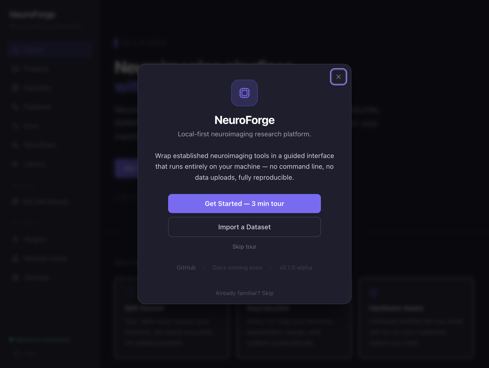

# Neuravian

**A local-first workspace for reproducible neuroimaging research.**

[](https://github.com/SadhanaArivoli/neuravian/actions/workflows/ci.yml)
[](LICENSE)
[](CHANGELOG.md)
[](https://bids.neuroimaging.io/)




Neuravian brings datasets, trusted neuroimaging tools, runs, artifacts,
lineage, reports, and methods into one application. It records what ran, which
inputs and parameters were used, and what each run produced—so the history of an
analysis remains inspectable after the command has finished.

Neuravian does **not** replace MRIQC, fMRIPrep, FSL, FastSurfer, Nilearn, or
other scientific software. It orchestrates those tools, presents their outputs,
and preserves a reproducible record around them.

> **Early Access — research use only.** Neuravian is not a medical device and
> does not validate scientific interpretation or provide clinical guidance.
> Pipeline availability is not the same as execution qualification. See the
> [canonical pipeline status](docs/pipeline-status.md) and
> [known limitations](docs/known-limitations.md) before using it in a study.

## Why Neuravian?

- **Unified workspace** — organize projects, BIDS datasets, pipeline runs,
  reports, and publication outputs without maintaining a parallel spreadsheet.
- **Automatic provenance** — capture tool and runtime versions, commands,
  parameters, container details, timestamps, inputs, outputs, and checksums.
- **Provenance-based methods drafts** — generate methods text and citation
  lists from recorded provenance rather than memory. Researcher review remains
  required.
- **Structured artifact management** — register outputs by scientific type and
  connect them to the run and dataset that produced them.
- **Interactive visualization** — inspect NIfTI volumes, surfaces, matrices,
  tables, figures, and HTML reports inside the same workspace.
- **Reproducible execution** — preserve logs, status, retry history, workflow
  state, and upstream/downstream lineage.
- **Pipeline-independent architecture** — manifests and the shared BIDS App
  adapter keep execution, artifact discovery, provenance, and reports consistent
  across tools.
- **Local-first desktop application** — source datasets remain local by default;
  transfer to researcher-managed compute requires explicit configuration and
  confirmation.
- **Open source** — Apache-2.0 licensed, with no telemetry and no required paid
  API.

## Download

Public installers have not yet been attached to a GitHub Release. The repository
currently produces an unsigned macOS Apple Silicon application bundle; Windows
and Linux desktop packages are not yet produced. This is a release blocker, not
something the documentation hides.

| Platform | Public download status | Current way to run Neuravian |
|---|---|---|
| macOS, Apple Silicon | Packaged locally; signing and notarization pending | Build the unsigned `.app` from a checkout, or use Docker Compose |
| macOS, Intel | No desktop package | Docker Compose |
| Windows | No desktop package; not qualified in CI | WSL2 may work, but is not a supported public-release path |
| Linux | No desktop package | Docker Engine with Compose v2 |

When release assets are published, they will appear on the
[GitHub Releases page](https://github.com/SadhanaArivoli/neuravian/releases).
Until then, follow the [installation guide](docs/installation.md). Docker is
required by the current desktop shell and container pipelines.

## Requirements

Neuravian checks for several local prerequisites during desktop startup, but
researchers should review this table before installation. Pipeline-specific
requirements are also shown during preflight.

| Requirement | Baseline | Why it is needed |
|---|---|---|
| Operating system | Packaged desktop: macOS on Apple Silicon. Docker deployment: macOS or Linux. Windows/WSL2 is not release-qualified. | The current desktop bundle and CI matrix do not cover every platform. |
| Docker runtime | Docker Desktop on macOS, or Docker Engine on Linux | The application services and established scientific containers run through Docker. |
| Docker Compose | Compose v2; desktop development has been tested with 2.24.4 or newer | Neuravian starts the frontend, backend, database mounts, and pipeline runtime as one Compose project. |
| CPU architecture | Apple Silicon works for the desktop and qualified local MRIQC path. Several scientific images require native `x86_64` Linux or run slowly under emulation. | Container architecture is determined by each upstream tool, not by Neuravian. Preflight blocks known-unsafe combinations. |
| Memory | 8 GB host minimum; 16 GB recommended for MRIQC; 32 GB recommended for fMRIPrep evaluation | Scientific workflows can hold multiple full-resolution volumes and worker processes in memory. Docker Desktop must also be allocated enough memory. |
| Free disk space | Start with at least 20 GB free; 50 GB is a practical general recommendation. fMRIPrep declares 100 GB minimum, FastSurfer 30 GB, and MRIQC 10 GB. | Container images, working directories, derivatives, reports, logs, and caches are stored locally. |
| Internet connection | Required for initial source/dependency installation, container pulls, and first-use model or atlas downloads. Researcher-managed cloud workspaces also require network access. | Neuravian does not redistribute every upstream image, model, or atlas. Cached local workflows may later run offline. |
| GPU | Not required for the qualified MRIQC path or normal application use | FastSurfer and SynthStrip offer optional NVIDIA CUDA paths. They require compatible hardware, drivers, and NVIDIA Container Toolkit; CPU remains the conservative default. |
| Dataset access | A readable BIDS dataset directory; source mounts are read-only by default | Neuravian registers and validates existing research data instead of copying it into a proprietary format. |
| FreeSurfer license | Required only by integrations that declare it, including fMRIPrep and FastSurfer | Those upstream tools require their own license file even though Neuravian is Apache-2.0 licensed. |

Optional external viewers include FreeView and MRIcroGL. They are not needed for
the built-in viewer. Git and Node.js 20 are developer/source-build requirements,
not requirements for a future signed end-user installer.

Pipeline prerequisites are not interchangeable: MRIQC, fMRIPrep, FastSurfer,
the local FSL wrappers, model-backed tools, and future integrations have distinct
image, license, architecture, storage, and optional GPU needs. The
[pipeline-specific requirements table](docs/installation.md#pipeline-specific-requirements)
states what is currently enforced and what must be qualified before future tools
are advertised.

The desktop startup shell currently detects macOS compatibility, Docker CLI,
Docker daemon health, Compose availability, occupied ports, total RAM, free disk
space, and repository resources. It should eventually add an explicit Compose
minimum-version warning, a small registry connectivity check before first pull,
and GPU/toolkit diagnostics only when a researcher selects a GPU option.

## Researcher quick start

The workflow is designed to be understood in a few minutes; scientific execution
time depends on the dataset and pipeline.

1. **Launch Neuravian.** Start the desktop application or the Docker Compose
   deployment.
2. **Create a project.** Use a project to group datasets, runs, notes, and
   publication outputs.
3. **Import a BIDS dataset.** Neuravian registers the folder without modifying
   the source data.
4. **Run BIDS Validator.** Review structural or metadata issues before launching
   a long-running tool.
5. **Run MRIQC.** Select participants, review preflight checks, and start the
   qualified local quality-control path.
6. **Inspect results.** Open the MRIQC HTML report, image-quality metrics,
   figures, logs, and registered artifacts.
7. **Inspect provenance.** Confirm the recorded image, runtime version, command,
   parameters, input identity, timestamps, and output records.
8. **Review the methods draft.** Export methods and citations, then verify them
   for scientific completeness.
9. **Choose a downstream step.** Neuravian can prefill compatible integrations,
   but the status table must be checked before treating a downstream tool as
   execution-qualified.

See the illustrated [quickstart](docs/quickstart.md),
[viewer guide](docs/viewer-guide.md), and
[troubleshooting guide](docs/troubleshooting.md).

## Pipeline status

Neuravian uses conservative status labels:

- **Qualified** — a documented end-to-end execution exists for the stated
  environment and scope.
- **Integrated** — the repository contains execution, parameters, artifact
  discovery, and provenance support, but no complete public qualification is
  claimed.
- **Experimental** — available for evaluation with incomplete operational
  evidence or known limitations.
- **Planned** — not implemented; shown only to prevent roadmap items from being
  mistaken for current functionality.

| Tool or integration | Status | What the status means |
|---|---|---|
| MRIQC participant | **Qualified with limitations** | Local public-BIDS execution completed; progress behavior was fixed afterward but not requalified with another full participant run |
| MRIQC group | **Qualified with limitations** | Local group execution, lineage, report, methods, and citation evidence exist |
| fMRIPrep | **Integrated; qualification pending** | Official container, shared BIDS App adapter, preflight, outputs, provenance, and UI are implemented; no completed scientific execution on this Apple Silicon host |
| BIDS Validator, dcm2niix, dcm2bids | **Integrated** | Runnable manifests and platform support exist; no formal public qualification package is claimed here |
| FSL BET, FAST, FLIRT, FNIRT | **Integrated** | Docker-wrapper integrations exist; users must provide/build the documented images and verify their environment |
| FastSurfer, SynthStrip, BrainChop, pydeface | **Integrated** | Execution and artifact handling exist; no broad platform qualification is claimed |
| Neuravian native analysis tools | **Integrated** | Implemented and tested, with report/viewer evidence; not substitutes for inferential or clinical validation |
| FreeSurfer `recon-all`, QSIPrep, ANTs pipelines, MRtrix3, AFNI | **Planned / not implemented** | Neuravian does not currently launch these as standalone pipelines |

The complete manifest-by-manifest table, environments, and evidence links live in
[`docs/pipeline-status.md`](docs/pipeline-status.md). That file is the canonical
status source; other documentation should link to it instead of maintaining a
second support matrix.

## How Neuravian differs

| Existing tool | Its role | Neuravian's role |
|---|---|---|
| MRIQC, fMRIPrep, FSL, FastSurfer | Perform established scientific processing | Configure and launch the tool, retain logs, register outputs, and record provenance |
| BIDS Validator, dcm2niix, dcm2bids | Validate or organize input data | Connect validation and conversion to the same dataset and run history |
| Nilearn, NiBabel, NetworkX | Provide scientific Python building blocks | Expose selected, documented analyses through typed inputs and reproducible outputs |
| Standalone viewers and HTML reports | Inspect one output format | Open multiple artifact types while preserving their dataset and run context |
| Shell scripts and notebooks | Offer flexible automation | Add persistent lineage, artifact discovery, methods drafts, and a guided researcher interface |

The scientific tools remain authoritative for their algorithms, citations,
licenses, and interpretation guidance.

## What gets recorded

For each run, Neuravian can retain:

- project and dataset identity;
- participant and session selection;
- pipeline and runtime version;
- container image and digest when available;
- command and resolved parameters;
- input and output artifacts;
- checksums and lineage relationships;
- start time, end time, status, logs, warnings, and errors.

Methods Studio and report generation use these records. Generated text is a
draft from provenance—not an assertion that the analysis is scientifically
appropriate or publication-ready without review.

## Privacy and deployment model

Neuravian is single-researcher and local-first by default. Source datasets are
mounted read-only in the standard deployment. The application includes no
telemetry and does not require a Neuravian account.

Optional remote execution and cloud workspaces target infrastructure configured
and controlled by the researcher. They are not a hosted Neuravian service.
Authentication, network isolation, de-identification, backups, cost controls,
and institutional policy remain the researcher's responsibility. Do not expose
the backend directly to an untrusted network.

## Screenshots

| Surface | Preview |
|---|---|
| Workspace | [Desktop workspace](docs/desktop/screenshots/desktop-native-app.png) |
| Pipelines | [Pipeline catalog](docs/screenshots/visual-consistency/after-pipelines.jpg) |
| MRIQC | [Qualified participant report](docs/qa/mriqc-execution-qualification/screenshots/participant-run-124-fixed.png) |
| Viewer | [Scientific image viewer](docs/qa/scientific-viewer-v2/seed-run-71-1440x900.png) |
| Reports | [Embedded report](docs/qa/report-design-system/functional-connectivity-run-87-embedded.jpg) |
| Artifacts | [Artifact Explorer](docs/qa/workstation-polish/before-artifact-explorer.png) |
| Provenance and methods | [Methods Studio](docs/qa/mriqc-execution-qualification/screenshots/methods-run-131.png) |
| Settings | [Settings](docs/qa/early-access-polish/after-settings.png) |

The [screenshot audit](docs/screenshots/README.md) identifies which images are
current release candidates and which historical images should not be reused in
public-facing material.

## Developer installation

Developer setup is intentionally separate from the researcher workflow.

```bash
git clone https://github.com/SadhanaArivoli/neuravian.git
cd neuravian
cp .env.example .env
```

Set `HOST_DATASETS_DIR` in `.env` to the parent directory containing your BIDS
datasets, then start the canonical development deployment:

```bash
docker compose up --build
```

Open <http://localhost:3000>. For backend, frontend, desktop, migration, and test
commands, see [CONTRIBUTING.md](CONTRIBUTING.md). For the current unsigned macOS
bundle, see [desktop/README.md](desktop/README.md).

## Documentation

- [Documentation index](docs/README.md)
- [Installation](docs/installation.md)
- [Quickstart](docs/quickstart.md)
- [Canonical pipeline status](docs/pipeline-status.md)
- [Known limitations](docs/known-limitations.md)
- [Architecture](docs/architecture.md)
- [Workflow guide](docs/workflow-guide.md)
- [Viewer guide](docs/viewer-guide.md)
- [Plugin development](docs/plugin-development.md)
- [Security policy](SECURITY.md)
- [Contributing](CONTRIBUTING.md)

## Citation

Use the metadata in [`CITATION.cff`](CITATION.cff). Generated methods and
pipeline citations remain subject to researcher review.

## License

Neuravian is released under the [Apache License 2.0](LICENSE). Integrated tools,
containers, atlases, and datasets retain their own licenses and citation
requirements.
