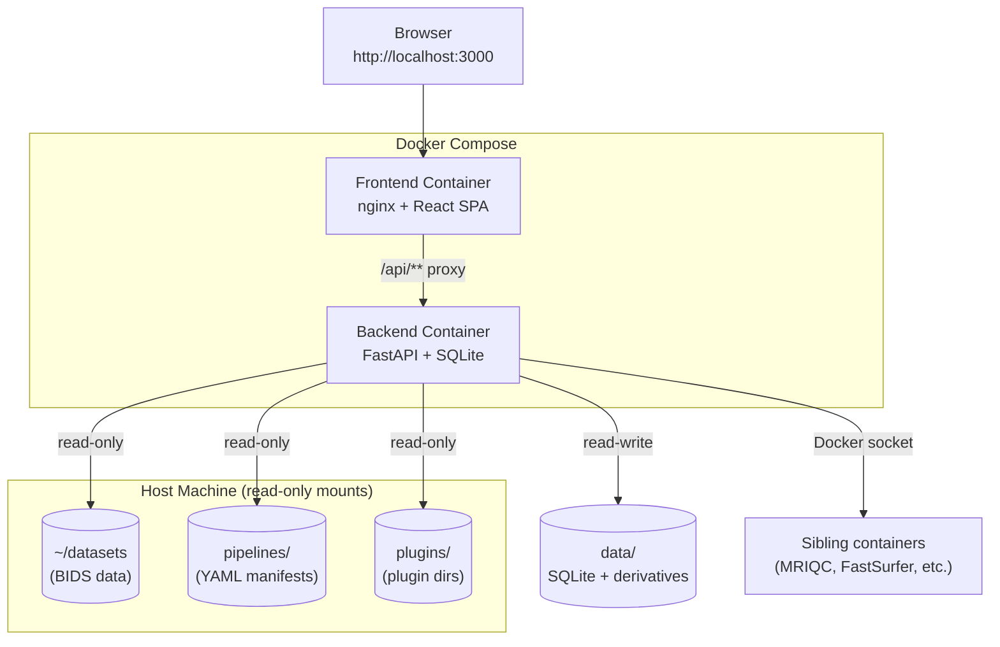
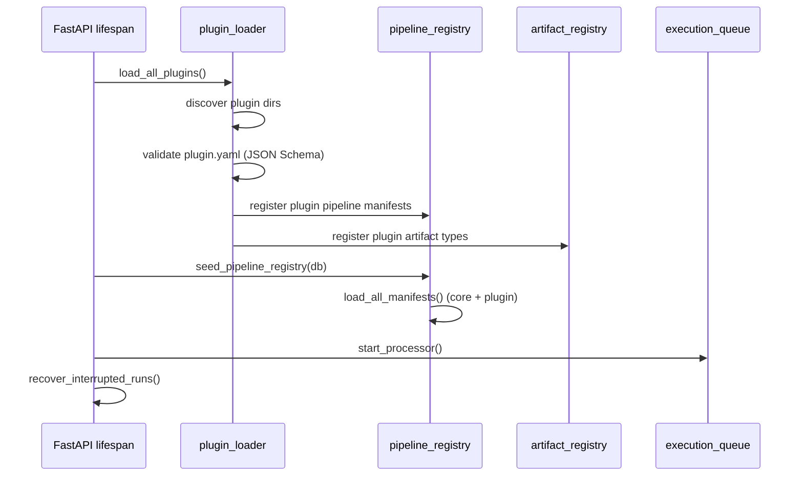
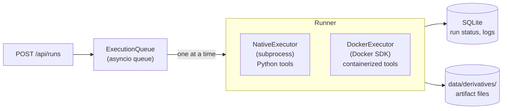
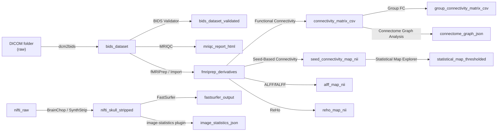
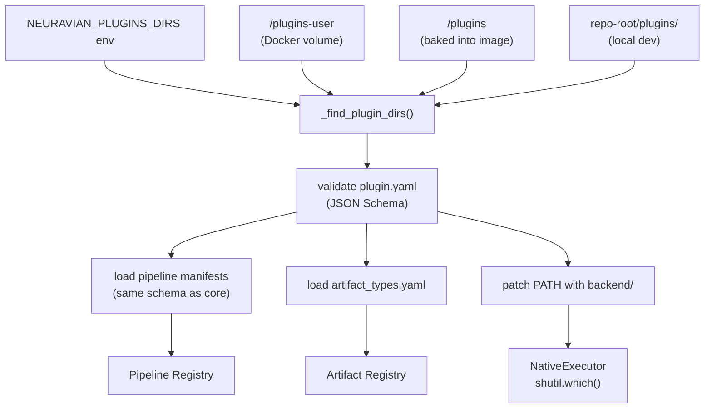
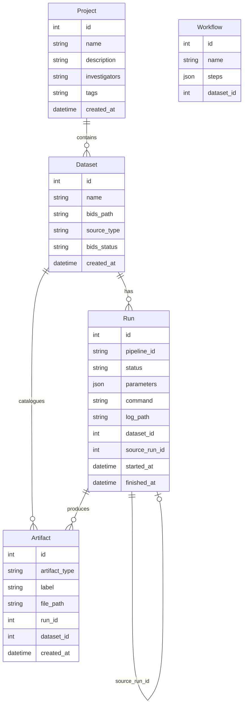
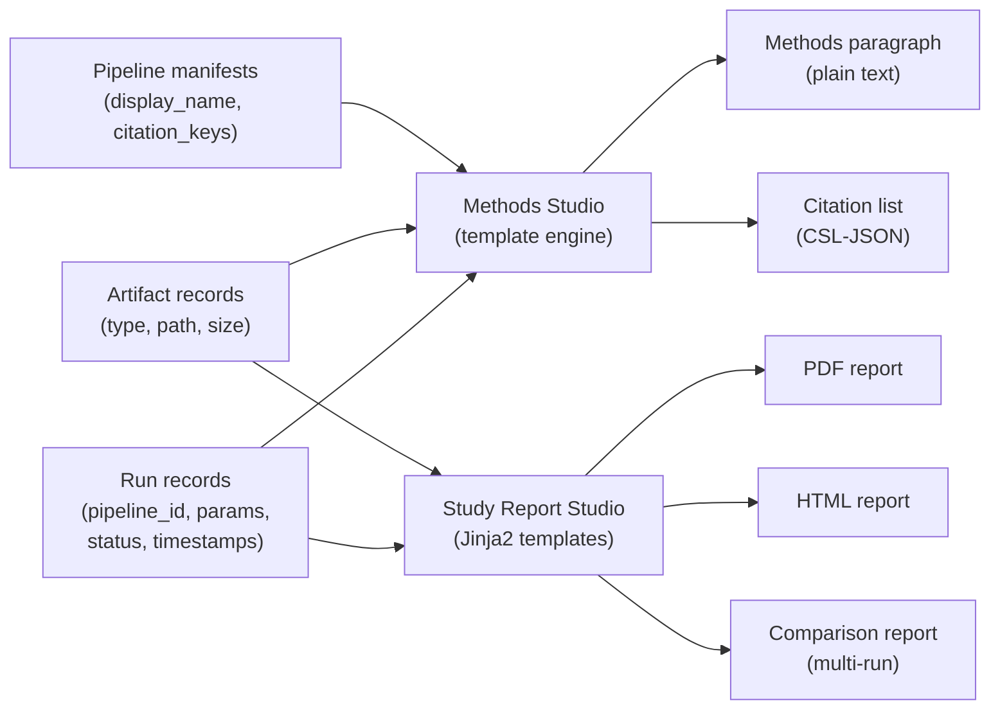

# Neuravian Architecture

This document describes the technical architecture of the Neuravian 0.1.0
Early Access release candidate. Pipeline availability and qualification are
tracked separately in [pipeline-status.md](pipeline-status.md).

---

## System Overview

Neuravian is a local-first web application. Everything runs on the researcher's machine inside Docker Compose. No data leaves the machine unless the researcher explicitly configures remote execution.



---

## Backend

The backend is a FastAPI application (`backend/app/`) with SQLite persistence via SQLAlchemy and Alembic migrations.

### Startup sequence



Plugins are discovered before the pipeline registry is built so plugin pipelines appear in the registry on first request.

### Directory layout

```
backend/app/
├── api/           — FastAPI route handlers (one file per domain)
├── core/          — database session, settings, path utilities
├── execution/     — DockerExecutor, NativeExecutor, SSHExecutor
├── models/        — SQLAlchemy ORM models (Run, Artifact, Dataset, …)
├── services/      — PipelineService, RunService, ExecutionQueue, plugin_loader
└── tools/         — native Python pipeline entry points (Nilearn, nibabel, NetworkX)
```

### Execution model



The execution queue is sequential by design — one job at a time on a laptop. Future versions may add parallel lanes for tools that are CPU-light.

---

## Pipeline manifests

Every pipeline is declared in a YAML file in `pipelines/`. The backend loads all manifests at startup; no pipeline logic is hardcoded in application code.

```
pipelines/
├── schema/
│   ├── manifest.schema.json    — JSON Schema for pipeline YAML validation
│   ├── artifact_types.yaml     — global vocabulary of typed artifacts
│   └── plugin.schema.json      — JSON Schema for plugin.yaml validation
└── *.yaml                      — one file per pipeline (20 core pipelines)
```

A manifest declares:

| Field | Purpose |
|---|---|
| `id` | Stable identifier used in all run records |
| `display_name` | Human-readable name shown in the UI |
| `execution.type` | `native` (Python subprocess) or `docker` (Docker SDK) |
| `compute_profile` | `local-ok`, `local-slow`, or `local-unsafe` |
| `accepts[]` | Typed artifact slots this pipeline reads |
| `produces[]` | Typed artifact slots this pipeline writes |
| `parameters[]` | Typed parameters with defaults, options, and help text |
| `known_errors[]` | Regex patterns matched against stderr for plain-English error translation |

---

## Artifact lineage

Every run produces typed artifacts registered in the artifact registry. The compatibility API uses declared `accepts[]` types to compute valid next steps.



---

## Plugin system



Plugin directories are scanned in priority order: env var → `/plugins-user` → `/plugins` → local dev. The first directory to define a plugin ID wins; later directories cannot override it.

---

## Frontend

The frontend is a React + TypeScript SPA built with Vite. It communicates exclusively through the `/api` REST interface.

```
frontend/src/
├── api/           — typed API client (fetchXxx functions + TypeScript interfaces)
├── components/
│   ├── primitives/    — Sidebar, layout, shared UI atoms
│   └── domain/        — RunResults, ArtifactPreview, ComparisonStudio, …
├── hooks/         — react-query data-fetching hooks (one per resource type)
├── lib/           — pure logic (methods engine, workflow persistence, statistics helpers)
└── pages/         — one file per route
```

State management: react-query for server state; React `useState`/`useReducer` for ephemeral UI state. No global client-side store.

---

## Data model



---

## Study report generation



The methods paragraph is generated by template filling from provenance records — not by a language model. Every sentence traces directly to a logged field. If the data was not captured at run time, it does not appear in the output.

---

## Deployment

The canonical deployment is Docker Compose:

```
docker compose up
```

| Container | Image | Exposed port |
|---|---|---|
| frontend | nginx + React build | 3000 |
| backend | Python 3.12 + FastAPI | 8000 (internal only) |

The frontend nginx config proxies `/api/**` to `http://backend:8000/api/**`. The browser never talks directly to the backend port.

**Local development** (without Docker):

```bash
# Terminal 1 — backend
cd backend
uv sync --extra dev
uv run alembic upgrade head
uv run uvicorn app.main:app --reload   # http://localhost:8000

# Terminal 2 — frontend
cd frontend
npm install
npm run dev   # http://localhost:5173 (proxies /api to :8000)
```

---

## CI

GitHub Actions runs on every push and pull request:

1. Backend: `uv run pytest` (538 tests)
2. Frontend: `npx tsc --noEmit` + `npx vitest run` (279 tests) + `npx vite build`

See [`.github/workflows/ci.yml`](../.github/workflows/ci.yml).
