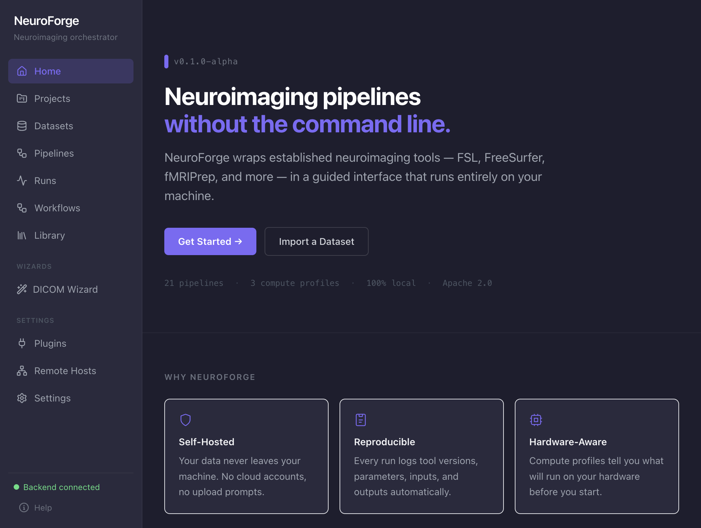

# Desktop Docker CLI discovery verification

Verified on macOS Apple Silicon on 2026-07-14 with the exact unsigned bundle at
`desktop/dist/mac-arm64/NeuroForge.app`.

## Root cause and fix

The launcher previously spawned the bare command name `docker`. Applications
started through Finder/Launch Services do not reliably inherit the interactive
shell PATH, so `/usr/local/bin/docker` could exist and work in Terminal while
Electron incorrectly reported “Docker not installed.”

The launcher now resolves Docker once in this order:

1. executable `docker` candidates from the inherited `PATH`
2. `/usr/local/bin/docker`
3. `/opt/homebrew/bin/docker`
4. `/Applications/Docker.app/Contents/Resources/bin/docker`
5. `/usr/bin/which docker`
6. `/bin/zsh -lc 'command -v docker'`

Only an executable absolute path is accepted. The resolved path is then stored
and used for `--version`, `info`, `compose version`, Compose start, stop, and log
commands. No post-discovery launcher command spawns the bare name `docker`.

The sanitized diagnostics include `dockerPath`, `dockerVersion`, and
`composeVersion`. Partial Docker facts are retained when daemon or Compose
detection fails, so those states remain distinct and actionable.

## Finder and Terminal QA

For the Finder regression, the Launch Services PATH was temporarily restricted
to `/usr/bin:/bin:/usr/sbin:/sbin` and restored immediately after process
creation. The packaged app resolved `/usr/local/bin/docker`, reported Docker
29.6.1 and Compose v5.3.0, detected the existing backend and frontend at HTTP
200, attached with external ownership in 629 ms, and rendered the main
NeuroForge UI inside Electron. No browser interaction was used. The attempt had
no renderer warning, renderer error, or failed-stage log entries.

The same bundle was also launched directly from Terminal with
`PATH=/usr/local/bin:/usr/bin:/bin`. It resolved the same absolute binary,
attached the healthy stack in 593 ms, and confirmed the visible UI 89 ms after
the renderer Ready acknowledgement.

Focused tests cover inherited PATH priority, Finder PATH without `/usr/local`,
the `/usr/local`, Apple Silicon Homebrew, and Docker Desktop fallbacks, both
lookup-command fallbacks, complete lookup failure, daemon stopped, Compose
unavailable, absolute-path Compose invocation, and sanitized diagnostics.

Scientific pipelines, Compose configuration/behavior, backend APIs, and frontend
application logic were not changed.
